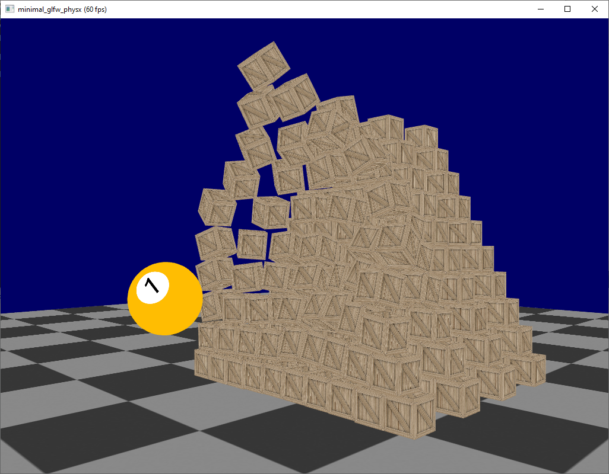

# Minimal GLFW PhysX Sample

## Description
minimal PhysX sample with CMake, GLFW, GLEW and GLM - project dependencies are included

## Build Instructions for VS2019
1. build PhysX
  * set runtime library to multi-threaded dll
    * edit Location\PhysX\physx\buildtools\presets\publicvc16win64.xml
    * set CMake switch NV_USE_STATIC_WINCRT to False
  * run generate_projects.bat with preset 13 (build files in Location/PhysX/physx/compiler/vc16win64)
  * fix include for MSVC2019
    * edit Location/PhysX/physx/source/foundation/include/PsAllocator.h
    * remove .h extension from #include <typeinfo.h> (line 40)
  * build PhysXSDK.sln
    * MSBuild PhysXSDK.sln /property:Configuration=Debug
    * MSBuild PhysXSDK.sln /property:Configuration=Release
2. set custom PhysX root in minimal_glfw_physx/src CMake file (line 53-54)
3. generate minimal_glfw_physx project with CMake
  * set glm_DIR to your local glm
  * configure & generate
4. build & run minimal_glfw_physx from VS2019
 * set MSVC Configuration Properties / Debugging / Environment - PATH=%PATH%;Location\PhysX\physx\bin\win.x86_64.vc142.md\$(Configuration)
 * build & run - enjoy

## References
 * [opengl-tutorial.org - Tutorial 6 : Keyboard and Mouse](http://www.opengl-tutorial.org/beginners-tutorials/tutorial-6-keyboard-and-mouse/)
 * [PhysXSDK - Snippets - SnippetHelloWorld](https://docs.nvidia.com/gameworks/content/gameworkslibrary/physx/guide/Manual/HelloWorld.html)
